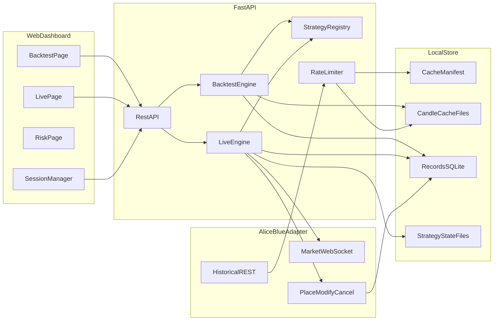
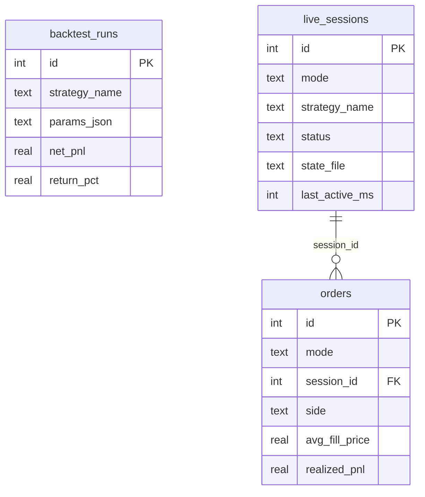
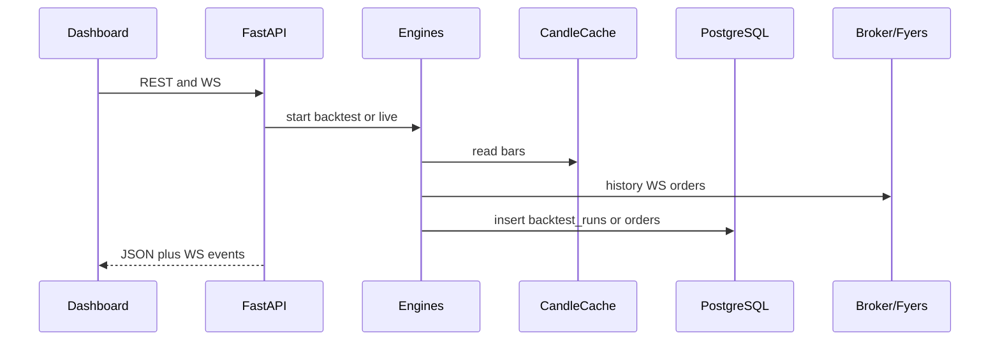
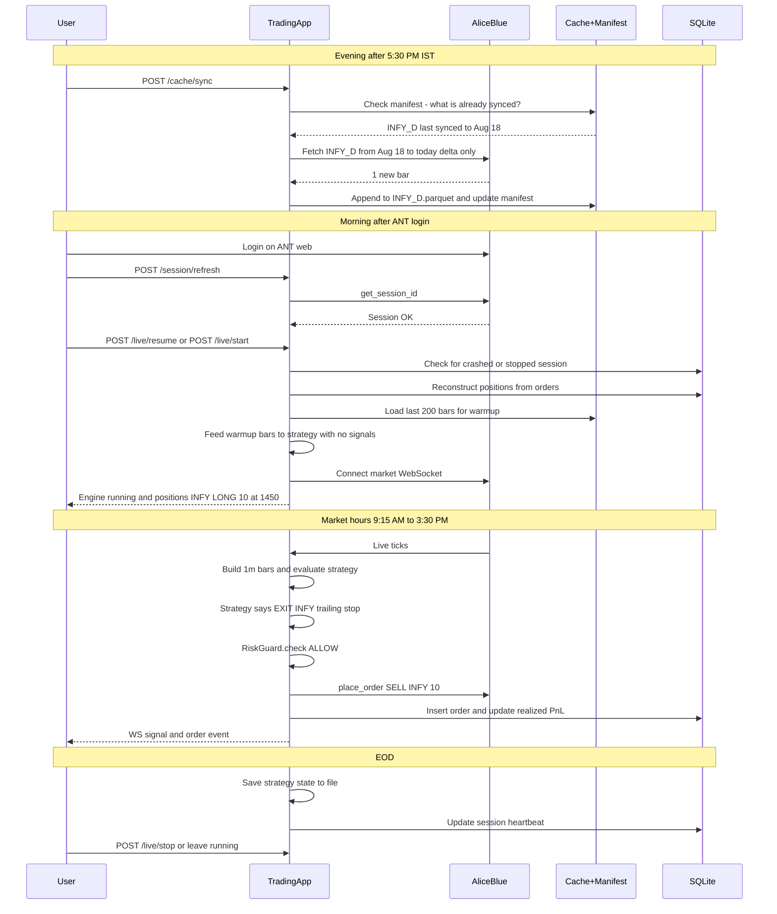
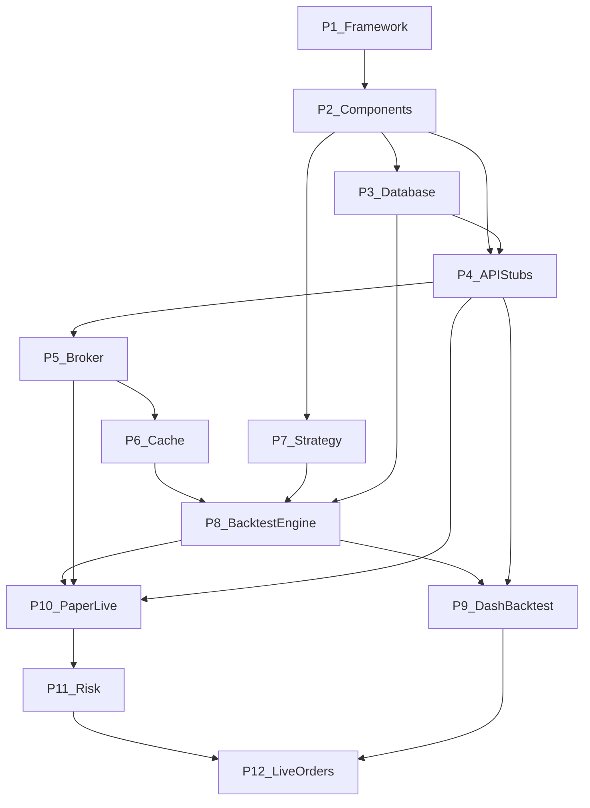

# Alice Blue backtest + live order platform

## Goal

A single local app with two modes that share **one strategy engine**, designed for **swing and momentum trading** (positions held 2–15+ days):

1. **Backtest** — run a strategy on cached NSE 1-minute / daily bars and **save the result + P&amp;L**.
2. **Live / paper** — stream LTP over Alice Blue WebSocket, evaluate the same conditions, and **save each order punch** (paper or real money). Positions carry overnight and across weekends.

v1 is **single-user, NSE equity/index, paper-first, CNC product** (overnight-safe). Live punching is gated behind an explicit arm switch.

### Design principles for swing/momentum

- **Nothing starts from scratch.** Historical sync is incremental (delta only). Live engine reconstructs open positions and strategy indicator buffers on every restart.
- **Crashes are expected.** The live engine persists session state every 5 minutes and on clean shutdown. On crash, the app detects the broken session and offers resume.
- **Rate limits are respected.** A token-bucket limiter gates all historical API calls. Large date ranges are chunked automatically.

## Alice Blue constraints that shape the design

These are product facts, not optional polish:

- **Historical API is off-hours only** (weekdays ~5:30 PM–8:00 AM IST; full access on weekends/holidays). During market hours it returns “data not available”. **Backtests must run from a local cache**, not from a live API call.
- Resolutions from Alice Blue: **`1` (minute)** and **`D` (day)** only. Higher timeframes (5m, 15m, etc.) are **resampled locally**.
- NSE history is about **2 years**.
- You must **log in once a day** on ANT web/app before API session works.
- Non-order REST is rate-limited (**~1800 / 15 min**). Orders themselves are not limited the same way.
- Official Python SDK: [`pya3`](https://github.com/Aliceblueofficial/pya3). REST/WS docs: [v2 API](https://v2api.aliceblueonline.com), [historical](https://ant.aliceblueonline.com/productdocumentation/Historical%20Data/).

Implication: a **sync job after market close** downloads candles into **disposable cache files** using **incremental delta sync** (only fetches bars newer than what's already cached). A **rate limiter** ensures we stay well under 1800 req/15 min. The dashboard never depends on Chart API during 9:15–15:30. SQLite is for records (backtest results, orders, and live session metadata).

## Architecture



Same `Strategy.on_bar()` / `Strategy.on_tick()` for both engines. Backtest feeds historical bars; live feeds aggregated 1-minute bars from ticks (plus LTP for intra-bar rules if needed).

## Stack (v1)

| Layer | Choice | Why |
| --- | --- | --- |
| Backend | FastAPI + uvicorn | Async WebSocket client + REST dashboard |
| Broker | Abstract Interfaces (Alice Blue implemented) | Plug-and-play adapter for placing orders |
| Data Storage | PostgreSQL (Records) + Parquet (Candles) | PostgreSQL for strict ACID records (sessions/orders/backtests). Parquet for daily market data. |
| Historical Data | Fyers Historical API | Fetching daily candles for swing trading. Tick-by-tick intraday data deferred to future phase. |
| Frontend | React + Vite | Backtest form, equity chart, live log, arm/kill |
| Config | `.env` (never commit keys) | `USER_ID`, `API_KEY`, paper vs live |

Suggested layout (empty repo today):

- `backend/app/broker/aliceblue.py` — session, history, WS, orders
- `backend/app/broker/fake.py` — FakeBroker for offline tests
- `backend/app/broker/rate_limiter.py` — **[NEW]** token-bucket rate limiter for history API
- `backend/app/data/sync.py` — after-hours candle download **with delta sync**
- `backend/app/data/manifest.py` — **[NEW]** cache manifest read/write (tracks what's already synced)
- `backend/app/data/store.py` — record tables (`backtest_runs`, `orders`, `live_sessions`)
- `backend/app/data/schema.sql` — `backtest_runs` + `orders` + `live_sessions`
- `data/app.db` — SQLite records (gitignored)
- `data/cache/` — disposable candle files (gitignored; not a record)
- `data/cache/_manifest.json` — **[NEW]** tracks synced date ranges per symbol/resolution
- `data/state/` — **[NEW]** strategy state files for live session persistence (gitignored)
- `config/watchlist.yaml` — symbols to sync/trade (not in DB)
- `backend/app/strategy/base.py` — interface with `serialize()`/`restore()` + `StrategyContext`
- `backend/app/strategy/sma_crossover.py` — simple SMA crossover (basic backtests)
- `backend/app/strategy/sma_momentum.py` — **[NEW]** swing/momentum strategy (SMA + RSI + volume + trailing stop)
- `backend/app/engine/backtest.py` — bar replay, costs, metrics
- `backend/app/engine/live.py` — WS → bars → signals → paper/live **with session persistence + warmup + crash recovery**
- `backend/app/risk.py` — qty caps, max orders/day, kill switch
- `backend/app/api/` — FastAPI routers (`session`, `cache`, `backtests`, `live`, `risk`, `orders`, `ws`)
- `frontend/` — dashboard
- `docs/` — session login checklist, paper vs live

## Database (records only)

Keep **PostgreSQL** for **things you would show an auditor or yourself months later**. Everything else is cache, memory, or config files.

**Three core tables:** `backtest_runs` (strategy result + P&L), `orders` (paper and live punches + fill P&L), and `live_sessions` (engine session tracking for swing trade persistence).



### Records vs not records

| Keep in PostgreSQL (record) | Do not store as a record |
| --- | --- |
| Finished backtest: what strategy, what params, what window, **P&amp;L and metrics** | Historical daily candles (Fyers fetch; ticks deferred to future Intraday phase) |
| Compact trade list **inside** the backtest row (`trades_json`) so you can see how P&amp;L was made | Equity curve per bar, every indicator value, every HOLD signal |
| Every paper or live **order punch**: symbol, side, qty, fill, status, broker id, **realized P&amp;L on exits** | Order-status event stream, WS payloads, sync job logs |
| **Live session metadata**: strategy, symbols, start time, status, state file path | Strategy indicator buffers (stored in state file, not DB) |
| | Instruments, watchlist, strategy catalog, risk flags, audit log |

**Candle cache (not a record):** Daily candles downloaded from Fyers Historical API write to `data/cache/{symbol}_{resolution}.parquet` (or CSV). Safe to delete and re-sync. **Cache manifest** (`data/cache/_manifest.json`) tracks what's already synced so delta sync works. Watchlist lives in `config/watchlist.yaml`. Risk arm/kill lives in `.env`. Strategy code lives in `backend/app/strategy/`.

*Note: Tick-by-tick storage and processing is explicitly pushed to a future phase. For v1 (Swing/Momentum), we rely on daily candles and only evaluate strategies upon candle close or aggregated intervals.*

**Strategy state files (not a record):** `data/state/{session_id}_state.json` holds serialized indicator buffers. Saved every 5 minutes during live and on clean shutdown. Used to restore strategy context on restart.

**Time:** `INTEGER` epoch ms UTC on record rows. Secrets never in PostgreSQL.

---

### Table 1 — `backtest_runs`

One row per run. Immutable after `status=success`. Re-run = new row.

| Column | Type | Why it is a record |
| --- | --- | --- |
| `id` | INTEGER PK | |
| `created_at_ms` | INTEGER | When you ran it |
| `strategy_name` | TEXT | e.g. `sma_crossover` |
| `strategy_version` | TEXT | Code version |
| `params_json` | TEXT | Fast/slow SMA, etc. |
| `symbol` | TEXT | e.g. `INFY` |
| `exchange` | TEXT | `NSE` |
| `resolution` | TEXT | `1` / `5` / `15` / `D` |
| `from_ms` | INTEGER | Data window |
| `to_ms` | INTEGER | |
| `starting_capital` | REAL | |
| `brokerage_bps` | REAL | Cost assumptions |
| `slippage_bps` | REAL | |
| `fill_rule` | TEXT | `next_open` |
| `status` | TEXT | `success` \| `failed` |
| `error` | TEXT | If failed |
| `net_pnl` | REAL | **Main P&amp;L** |
| `return_pct` | REAL | vs starting capital |
| `ending_equity` | REAL | |
| `max_drawdown_pct` | REAL | Risk of the run |
| `n_trades` | INTEGER | |
| `n_wins` | INTEGER | |
| `n_losses` | INTEGER | |
| `win_rate` | REAL | |
| `fees_paid` | REAL | |
| `trades_json` | TEXT | Compact round-trips only (see below) |

`trades_json` is a small list, not a child table — enough to explain P&amp;L, not a tick chart:

```json
[
  {"side": "LONG", "qty": 10, "entry_ts_ms": 0, "entry_price": 0, "exit_ts_ms": 0, "exit_price": 0, "pnl": 0, "fees": 0}
]
```

No `backtest_equity`, `backtest_signals`, or `strategies` tables. The dashboard may draw an equity curve **in the browser for that run** from `trades_json` or from in-memory replay; it is not persisted as bars.

---

### Table 2 — `orders`

One row per punch. **Paper and live share this table** (`mode`). This is the trading record.

| Column | Type | Why it is a record |
| --- | --- | --- |
| `id` | INTEGER PK | |
| `mode` | TEXT | `paper` \| `live` |
| `session_id` | INTEGER NULL FK | References `live_sessions.id`; links order to its engine session |
| `placed_at_ms` | INTEGER | |
| `updated_at_ms` | INTEGER | Last status change |
| `strategy_name` | TEXT | Which strategy fired |
| `symbol` | TEXT | Snapshot (no instruments table) |
| `exchange` | TEXT | `NSE` |
| `trading_symbol` | TEXT | Alice Blue symbol used |
| `token` | TEXT | Instrument token used |
| `side` | TEXT | `BUY` \| `SELL` |
| `product` | TEXT | `CNC` \| `MIS` |
| `order_type` | TEXT | `MARKET` \| `LIMIT` |
| `qty` | INTEGER | |
| `limit_price` | REAL NULL | |
| `status` | TEXT | `complete` \| `rejected` \| `cancelled` \| `open` \| `failed` |
| `avg_fill_price` | REAL NULL | |
| `filled_qty` | INTEGER | |
| `broker_order_id` | TEXT NULL | Live only; paper is null |
| `reject_reason` | TEXT NULL | |
| `signal_reason` | TEXT | Why we punched, e.g. `sma_cross_up_rsi_vol_confirm` |
| `realized_pnl` | REAL NULL | Set on **exit** fills (flatten); null on entries |
| `fees` | REAL | Estimated (paper) or from broker if available |

Lifecycle: paper `complete` immediately at LTP. Live: insert as `open`/`submitted`, update `status` / `avg_fill_price` when Alice Blue confirms. Do **not** keep `order_events`, `fills`, `live_signals`, or `positions` tables — current position is **reconstructed** from all `orders` for that session/mode (`BUY` qty minus `SELL` qty per symbol). This reconstruction works across restarts.

**P&L for live/paper:** sum `realized_pnl` on completed exits, filtered by `mode` and date (or `session_id`). Unrealized P&L is LTP minus avg entry, **not** stored.

No `app_settings`, `risk_events`, `audit_log`, `sync_jobs`, or `candles` in PostgreSQL. Kill switch and limits are process config. Broker request/response JSON is not stored (status + reject_reason + broker_order_id are enough).

---

### Table 3 — `live_sessions`

One row per engine session. Tracks swing/momentum sessions that span multiple days and survive restarts.

| Column | Type | Why it is a record |
| --- | --- | --- |
| `id` | INTEGER PK | |
| `mode` | TEXT | `paper` \| `live` |
| `strategy_name` | TEXT | e.g. `sma_momentum` |
| `strategy_version` | TEXT | Code version |
| `params_json` | TEXT | Strategy parameters |
| `symbols_json` | TEXT | `["INFY","TCS"]` |
| `product` | TEXT | `CNC` \| `MIS` |
| `started_at_ms` | INTEGER | First start |
| `last_active_ms` | INTEGER | Last heartbeat (updated every 5 min) |
| `stopped_at_ms` | INTEGER NULL | Clean stop time |
| `status` | TEXT | `active` \| `stopped` \| `crashed` |
| `state_file` | TEXT | Path to serialized strategy state, e.g. `data/state/42_state.json` |
| `crash_reason` | TEXT NULL | If status=crashed, what happened |

**Session lifecycle:**

1. `POST /live/start` → insert row with `status=active`
2. Every 5 min → update `last_active_ms` + save state file
3. `POST /live/stop` → set `status=stopped`, `stopped_at_ms`, final state save
4. Crash (process killed) → on next startup, detect `status=active` with stale `last_active_ms` → mark `status=crashed`
5. `POST /live/resume` → load state file, reconstruct positions from orders, continue with `status=active`

**State file** (`data/state/{session_id}_state.json`):

```json
{
  "session_id": 42,
  "strategy": "sma_momentum",
  "symbols": {
    "INFY": {
      "indicator_state": {
        "close_buffer": [1450.2, 1451.0, 1449.8],
        "volume_buffer": [125000, 130000, 118000],
        "last_signal": "BUY",
        "last_signal_bar_ms": 1692400000000
      }
    }
  },
  "saved_at_ms": 1692489000000
}
```

### Indexes and backup

- `backtest_runs(created_at_ms DESC)`
- `orders(mode, placed_at_ms DESC)`
- `orders(session_id)` — find all orders for a session
- `orders(broker_order_id)` unique where not null (live)
- `live_sessions(status)` — find active/crashed sessions quickly

Backup = copy `data/app.db`. Delete `data/cache/` anytime (manifest auto-rebuilds on next sync). Delete `data/state/` anytime (indicators warm up from cache).

### Engine ↔ storage

- History sync → cache files only + manifest update. **Delta sync**: only fetches bars newer than what's in the manifest.
- Backtest **reads** cache; **writes** one `backtest_runs` row.
- Live/paper: **writes `live_sessions` row on start**; **writes `orders` when punching** (or when a live order status changes); **saves strategy state file every 5 min**. On restart, **reconstructs positions** from `orders` and **restores indicator buffers** from state file (or warms up from cache). Blocked signals (kill switch, max qty) are logged to the app log, not the DB.

## API design

Base URL: `http://localhost:8000/api/v1`. JSON in/out. Timestamps are epoch **ms UTC**. Dashboard is local single-user: **no login JWT**. Alice Blue session is server-side only; keys never returned.

**Error body (all REST failures):**

```json
{ "error": { "code": "MARKET_HOURS", "message": "Historical API unavailable during market hours" } }
```

HTTP: 400 validation (`INVALID_PARAMS`); 404 (`NOT_FOUND`); 409 illegal state (`ENGINE_RUNNING`, `ALREADY_FLAT`); 422 risk (`KILL_SWITCH`, `NOT_ARMED`, `MAX_QTY`); 502 broker (`BROKER_ERROR`, `SESSION_EXPIRED`); 503 history during market hours (`MARKET_HOURS`).



### A. Dashboard REST (browser to FastAPI)

#### Session and health

- **GET /health** — `200` `{ "ok": true, "ts_ms": 0 }`
- **GET /session** — `200` `{ "connected": true, "user_id_masked": "AB***", "session_ok": true, "last_refresh_ms": 0, "needs_ant_login": false, "message": null }` or `502 SESSION_EXPIRED`
- **POST /session/refresh** — empty body; Alice Blue `get_session_id`; `200` same as GET /session

#### Config (read-only from files)

- **GET /config** — `{ "exchange": "NSE", "default_product": "CNC", "default_order_type": "MARKET", "fill_rule": "next_open" }`
- **GET /watchlist** — from yaml: `{ "items": [{ "symbol": "INFY", "exchange": "NSE", "token": "1594", "trading_symbol": "INFY-EQ", "sync_1m": true, "sync_daily": true, "live": true }] }`
- **GET /strategies** — `{ "items": [{ "name": "sma_crossover", "version": "1.0", "default_params": { "fast": 20, "slow": 50, "rsi_filter": false } }] }`
- **GET /strategies/{name}** — name, version, description, `params_schema`, `default_params`; `404` if unknown

#### Candle cache (incremental, not a record)

- **GET /cache/status** — `{ "market_hours": false, "history_api_ok": true, "rate_limit": { "requests_used": 12, "requests_remaining": 1488, "window_resets_ms": 0 }, "items": [{ "symbol": "INFY", "resolution": "1", "from_ms": 0, "to_ms": 0, "bars": 0, "last_sync_ms": 0, "path": "data/cache/INFY_1.parquet" }] }`
- **POST /cache/sync** — body `{ "symbols": ["INFY"], "resolution": "1", "from_ms": 0, "to_ms": 0, "force": false }` (`symbols` omitted = full watchlist; resolution `1` or `D`; **`force: true` ignores manifest and re-downloads**; default `force: false` does delta sync only). `202` `{ "job_id": "uuid", "status": "running" }`. `503 MARKET_HOURS`
- **GET /cache/sync/{job_id}** — `{ "job_id", "status": "running|success|failed|skipped_market_hours", "bars_written", "bars_skipped", "error", "started_at_ms", "finished_at_ms", "progress": { "total_symbols": 10, "completed_symbols": 3, "current_symbol": "INFY", "bars_fetched": 45000, "requests_used": 12, "requests_remaining": 1488, "estimated_remaining_seconds": 120 } }`

#### Backtests

- **POST /backtests** — body:

```json
{
  "strategy_name": "sma_crossover",
  "params": { "fast": 20, "slow": 50, "rsi_filter": false },
  "symbol": "INFY",
  "exchange": "NSE",
  "resolution": "15",
  "from_ms": 0,
  "to_ms": 0,
  "starting_capital": 100000,
  "brokerage_bps": 3,
  "slippage_bps": 2
}
```

  `201` full `BacktestRun`. `400 CACHE_MISSING` if bars not synced.

- **GET /backtests?symbol=&limit=50** — newest first, no trade list: `{ "items": [{ "id", "created_at_ms", "strategy_name", "symbol", "resolution", "from_ms", "to_ms", "status", "net_pnl", "return_pct", "n_trades", "max_drawdown_pct" }] }`
- **GET /backtests/{id}** — list fields plus `params`, `starting_capital`, `brokerage_bps`, `slippage_bps`, `fill_rule`, `ending_equity`, `n_wins`, `n_losses`, `win_rate`, `fees_paid`, `error`, `trades`
- **DELETE /backtests/{id}** — `204`

#### Live engine (with session persistence)

- **GET /live/status** — `{ "running", "mode": "paper", "session_id": 42, "strategy_name", "params", "started_at_ms", "ws_status", "subscribed": ["INFY"], "kill_switch", "live_armed", "positions": [{ "symbol", "qty", "avg_price", "side" }], "quotes": [{ "symbol", "ltp", "ts_ms" }] }`
- **POST /live/start** — `{ "mode": "paper", "strategy_name", "params", "symbols": ["INFY"], "product": "CNC", "order_type": "MARKET", "qty": 1, "force": false }`. `mode` is `paper` or `live`. `force: true` ignores crashed session and starts fresh. `200` status. `409 ENGINE_RUNNING`. `409 CRASHED_SESSION` (use `/live/resume` or `force: true`). `422 NOT_ARMED` if live without arm.
- **POST /live/resume** — `{ "session_id": 42 }`. Resumes a stopped or crashed session: loads state file, reconstructs positions from orders, reconnects WS. `200` status. `404` if session not found. `409 ENGINE_RUNNING`.
- **POST /live/stop** — empty; disconnect WS; save state file; set session `status=stopped`. No flatten. `200` `{ "running": false, "session_id": 42 }`
- **POST /live/flatten** — paper synthetic SELL or live exit. `200` `{ "orders": [ Order ] }`. `409 ALREADY_FLAT`
- **GET /live/sessions** — list past sessions: `{ "items": [{ "id", "mode", "strategy_name", "status", "started_at_ms", "last_active_ms", "stopped_at_ms" }] }`
- **GET /live/sessions/{id}** — session detail + associated orders count + open positions

#### Risk (in-memory, not SQLite)

- **GET /risk** — `{ "kill_switch", "live_armed", "max_qty_per_order", "max_notional_per_order", "max_orders_per_day", "max_open_positions", "allowed_product", "orders_today_live", "orders_today_paper" }`
- **PUT /risk** — subset of numeric/product fields only. `200` full risk
- **POST /risk/kill** / **POST /risk/unkill** — toggle kill; kill blocks new punches
- **POST /risk/arm** — body `{ "confirm": true }` required. **POST /risk/disarm**

#### Orders and P&L (SQLite records)

- **GET /orders?mode=paper|live&symbol=&from_ms=&to_ms=&status=&limit=100** — `{ "items": [ Order ] }`
- **GET /orders/{id}** — `Order`
- **POST /orders/{id}/cancel** — live open only; Alice Blue cancel; update same row. `409` if paper or terminal
- **GET /positions?mode=paper|live** — derived: `{ "items": [{ "mode", "symbol", "qty", "avg_price", "ltp", "unrealized_pnl" }] }`
- **GET /pnl?mode=paper|live&from_ms=&to_ms=** — `{ "mode", "from_ms", "to_ms", "realized_pnl", "fees", "n_orders", "n_exits" }`

**Order object:** `{ "id", "mode", "session_id", "placed_at_ms", "updated_at_ms", "strategy_name", "symbol", "exchange", "trading_symbol", "token", "side", "product", "order_type", "qty", "limit_price", "status", "avg_fill_price", "filled_qty", "broker_order_id", "reject_reason", "signal_reason", "realized_pnl", "fees" }`

### B. Dashboard WebSocket

**GET (upgrade) `/ws/live`**

Client: `{ "type": "ping" }` every 30s. Server events (`type` discriminator):

- `hello` — `{ running, mode, ws_status }`
- `quote` — `{ symbol, ltp, ts_ms }` (throttled ~1s)
- `bar_close` — `{ symbol, ts_ms, open, high, low, close, volume }`
- `signal` — `{ symbol, action, reason, ltp, accepted, reject_reason }`
- `order` — full `Order` on insert/update
- `engine` — `{ running, mode, ws_status, kill_switch, live_armed }`
- `error` — `{ code, message }`
- `pong` — `{}`

REST for forms/history; WS for the live page only.

### C. Internal backend (Python, not HTTP)

Routers call these. Engines never talk to Alice Blue or SQLite except through them.

**BrokerAdapter** (`aliceblue.py`): `refresh_session()`, `session_status()`, `fetch_history(token, exchange, resolution, from_ms, to_ms)`, `connect_market_ws(on_tick)`, `subscribe(instruments)`, `disconnect_market_ws()`, `place_order(...)`, `cancel_order(broker_order_id)`, `get_order_book()`.

**RateLimiter** (`rate_limiter.py`): Token-bucket rate limiter. `acquire()` blocks until a request slot is available. 1500 requests per 15 minutes (300 buffer for live/session calls). 500ms minimum gap between history calls.

**CandleCache**: `status()`, `sync(symbols, resolution, from_ms, to_ms, force=False)` → in-memory job with **delta sync** (checks manifest, only fetches new bars), `job_status(job_id)`, `load(symbol, resolution, from_ms, to_ms)` (resample 5m/15m from 1m), `load_last_n(symbol, resolution, n)` (for indicator warmup).

**CacheManifest** (`manifest.py`): `load()`, `get(symbol, resolution)`, `update(symbol, resolution, from_ms, to_ms, bar_count)`, `remove(symbol, resolution)`. Backed by `data/cache/_manifest.json`.

**RecordsRepo**: `insert_backtest`, `list_backtests`, `get_backtest`, `delete_backtest`, `insert_order`, `update_order`, `get_order`, `list_orders`, `sum_pnl`, `compute_open_positions(mode, session_id?)` → reconstructs positions from completed orders, `insert_session`, `update_session`, `get_session`, `get_active_session`, `list_sessions`.

**RiskGuard**: `get`, `update`, `kill`, `unkill`, `arm`, `disarm`, `check(OrderIntent) -> Allow | Deny(reason)`. Every paper/live punch goes through `check` first.

**Strategy**: `on_bar(bar, ctx, warmup=False) -> Signal | None` (`BUY` / `SELL` / `EXIT`). `serialize() -> dict` and `restore(state: dict)` for session persistence. `warmup_bars -> int` tells the engine how many bars to pre-feed on startup. Same class in both engines.

**BacktestEngine.run(request) -> BacktestRun**: cache load → replay → `insert_backtest`.

**LiveEngine**: `start`, `stop`, `resume`, `flatten`, `status`. Startup: check for crashed sessions → reconstruct positions from orders → load state file or warm up from cache → connect WS. Loop: tick → 1m bar → `on_bar(bar, ctx)` → `RiskGuard.check` → paper insert or `place_order` + insert → WS `signal` / `order`. Every 5 min: save state file + update session heartbeat. On stop: final state save + set session `stopped`.

### D. Outbound Alice Blue (backend to broker)

Dashboard never calls these. Adapter wraps: `pya3.get_session_id`; Chart history POST (`1`, `D`); market WS `wss://ws1.aliceblueonline.com/NorenWS`; place/cancel/order book REST; optional order-status WS.

### E. Request map (every dashboard action)

| UI action | Request |
| --- | --- |
| Open app | GET /health, /session, /watchlist, /strategies, /risk, /live/status |
| Refresh broker | POST /session/refresh |
| Sync history | POST /cache/sync, poll GET /cache/sync/{job_id}, GET /cache/status |
| Run backtest | POST /backtests |
| Past runs | GET /backtests, GET /backtests/{id} |
| Delete run | DELETE /backtests/{id} |
| Start paper/live | POST /live/start + WS /ws/live |
| Resume session | POST /live/resume |
| Stop / flatten | POST /live/stop, POST /live/flatten |
| Kill / arm / limits | POST /risk/kill, /unkill, /arm, /disarm; PUT /risk |
| Session history | GET /live/sessions, GET /live/sessions/{id} |
| Blotter | GET /orders, GET /orders/{id}, POST /orders/{id}/cancel |
| P&amp;L | GET /pnl, GET /positions |
| Live tape | WS quote, bar_close, signal, order, engine |

## Feature 1: Historical data + backtest

**Incremental sync (after hours) — never re-downloads what you already have**

- Input: `config/watchlist.yaml` (symbols + tokens).
- On `POST /cache/sync`, the system **checks the manifest** (`data/cache/_manifest.json`) first:
  - If a symbol/resolution is already synced up to date X, only fetch bars from X to now (delta sync).
  - If the symbol has never been synced, do a full download.
  - If `force: true` is passed, ignore the manifest and re-download everything.
- Pull `resolution=1` and `D` after hours into **cache files** (Parquet, not SQLite).
- **Chunked fetch**: large date ranges are split into chunks of ~5000 bars per API call (≈13 trading days for 1-minute data). Each chunk goes through the rate limiter.
- **Rate limiter**: token bucket with 1500 req/15 min capacity (300 buffer). 500ms minimum gap. Auto-retry on 429/5xx with exponential backoff (3 retries max).
- Resample 1m → 5m/15m in pandas when the user picks that interval.
- Persist only the **run result** (`backtest_runs`), not bars.
- Manifest is updated after each successful symbol sync.

**Rate limits and safety**

| Limit | Value | Rationale |
| --- | --- | --- |
| Max symbols per sync job | 50 | Prevent runaway jobs |
| Max date range per symbol | 2 years (730 days) | Alice Blue history depth |
| Max bars per API call | 5,000 | Broker response size limit |
| Request rate | 1,500 / 15 min | 300 buffer for live/session calls |
| Min gap between requests | 500ms | Avoid burst throttling |
| Concurrent sync jobs | 1 | Sequential to respect rate limits |
| Auto-retry on 429/5xx | 3 times with exponential backoff | Network resilience |

**Cache manifest** (`data/cache/_manifest.json`):

```json
{
  "version": 1,
  "items": {
    "INFY_1": {
      "symbol": "INFY",
      "token": "1594",
      "resolution": "1",
      "from_ms": 1687305000000,
      "to_ms": 1692489000000,
      "bar_count": 245000,
      "last_sync_ms": 1692500000000,
      "file": "INFY_1.parquet",
      "checksum": "sha256:abc..."
    }
  }
}
```

**Backtest engine**

- Replay bars in time order; no lookahead (signal on bar close, fill next bar open or same-bar close — pick one and document it; default: **signal on close, fill next open**).
- Costs: brokerage + slippage bps (configurable).
- Output saved: `net_pnl`, metrics, `trades_json`. Charts for that session can be rendered from this without extra tables.

**Dashboard**

- Symbol, interval, date range, strategy params, run button.
- Show last run metrics + trade list from the saved row.
- Cache status shows per-symbol sync state from manifest (last synced, bar count, date range).
- Sync progress shows rate limiter status, bars fetched, estimated time remaining.

v1 strategies (easy to swap — registered by name):

1. **SMA fast/slow crossover** — simple version for basic backtests.
2. **SMA Momentum** — swing/momentum strategy with SMA crossover + RSI filter + volume confirmation + trailing stop + target exit. Primary strategy for live trading.

## Feature 2: Live data + order punching (swing/momentum persistent)

**Market data**

- Connect Alice Blue market WebSocket, heartbeat, subscribe watchlist.
- Build 1-minute OHLC from ticks in memory; evaluate strategy on **completed** bars so live matches backtest.

**Session persistence — nothing starts from scratch**

For swing/momentum trading, positions are held for days/weeks. The live engine **must** survive restarts, crashes, and daily reconnects.

1. **On start**: create `live_sessions` row → reconstruct positions from `orders` table → load state file (if resuming) or warm up indicators from last N cached bars → connect WS.
2. **Every 5 minutes**: save strategy state to `data/state/{session_id}_state.json` + update `last_active_ms` heartbeat.
3. **On clean stop**: final state save + set session `status=stopped`.
4. **On crash**: next startup detects `status=active` with stale heartbeat → marks `status=crashed` → user can `POST /live/resume` or start fresh.
5. **On resume**: loads saved state file → restores indicator buffers (SMA, RSI history) → reconstructs positions → continues where it left off.

**Indicator warmup** (when no state file exists or starting fresh):

- Feed last N cached bars (default 200) to the strategy's `on_bar(bar, ctx, warmup=True)`.
- During warmup, signals are suppressed — only indicator buffers are populated.
- After warmup, the strategy has full context (SMA values, RSI, volume averages) and can generate real signals on the first live bar.

**Position reconstruction** (on every startup):

```
For each symbol in session:
  net_qty = SUM(filled_qty) WHERE side=BUY  -  SUM(filled_qty) WHERE side=SELL
  If net_qty > 0 → LONG position at weighted avg entry price
  If net_qty == 0 → flat
```

This is computed from the `orders` table, not stored separately. Works across any number of restarts.

**Execution modes**

1. **Paper (default)** — simulate fill at last LTP; insert `orders` with `mode=paper`, `session_id` set. No `place_order`.
2. **Live (opt-in)** — only if `LIVE_ARMED=true` **and** dashboard kill switch is off **and** risk checks pass, then `place_order` and upsert that row (`mode=live`).

**Risk (required before live)**

- Max quantity per order, max notional, max orders per day, one position per symbol, flatten/cancel-all on kill.
- Session health: if WS drops, stop new orders until reconnect.
- Log skipped signals to the application log only (not SQLite).

**Order lifecycle**

- Place → poll order book / order-status WS → **update the same `orders` row** (status, fill, `realized_pnl` on exits).
- Rejected orders never retry in a tight loop.

**Daily workflow for swing trading:**



## Auth / ops

- Env: Alice Blue `user_id` + `api_key`.
- On app start: `get_session_id()`; surface a clear error if daily ANT login was skipped.
- Secrets stay in `.env`; dashboard never shows the key.

## Phased delivery (build each piece separately)

Rule: **finish and prove one phase before starting the next.** Each phase has a folder/module, tests, and a “done when” check. Later phases depend on earlier interfaces, not on unfinished UI.



Do not skip FakeBroker / stub APIs: that is what keeps the system testable without market hours or real money.

---

### Phase 1 — Framework only

**Build:** repo layout, `uv`/`pip` backend, FastAPI app factory, CORS, uvicorn, React+Vite `frontend/` with a blank shell, `.env.example`, `.gitignore` (`data/`, `.env`), `README` how to run two processes, structured logging.

**Do not build:** Alice Blue, SQLite, strategies, dashboard pages.

**Done when:** `GET /api/v1/health` returns `{ "ok": true }`; frontend loads “Consistent” shell; `pytest` runs an empty suite.

---

### Phase 2 — Shared components

**Build:** Pydantic models (`Bar`, `Order`, `BacktestRun`, `LiveSession`, `ErrorBody`, `OrderIntent`, `Signal`, `StrategyContext`, `Position`), `AppError` + HTTP mapping, `Settings` from env (no secrets logged), `config/watchlist.yaml` loader, time helpers (IST/UTC ms).

**Do not build:** DB writes, routers beyond health.

**Done when:** unit tests for watchlist YAML, timestamp conversion, error envelope JSON, `Signal` includes `stop_loss`/`target`/`trailing_stop_pct` fields.

---

### Phase 3 — Database only

**Build:** `schema.sql` (`backtest_runs`, `orders`, `live_sessions`), `RecordsRepo`, SQLite WAL + FK, pytest against a temp file. `orders.session_id` FK to `live_sessions.id`.

**Do not build:** FastAPI CRUD yet (optional tiny script is OK), no candles in SQL.

**Done when:** insert/list/get/delete backtest; insert/update/list orders; `sum_pnl` / `compute_open_positions`; insert/update/list sessions; session-order FK works; tests pass without network.

---

### Phase 4 — API contracts (stubs)

**Build:** every dashboard REST route from the API spec with request/response models. Handlers call **stub services** (in-memory lists, fake session `needs_ant_login: true`). OpenAPI at `/docs`. `WS /ws/live` sends `hello` + `pong` only.

**Do not build:** real engines or broker.

**Done when:** you can click through `/docs` and exercise all paths; contract tests (`httpx` ASGI) for status codes and error shape.

---

### Phase 5 — Broker adapter (isolated)

**Build:** `BrokerAdapter` protocol; `AliceBlueAdapter` (`session`, `fetch_history`, WS hooks, `place_order`, `cancel_order`, `get_order_book`); **`FakeBroker`** with fixture bars and fake fills.

**Do not build:** live engine loop or dashboard trading.

**Done when:** FakeBroker tests pass offline; optional manual script `refresh_session` against real Alice Blue (documented; skip if no keys).

---

### Phase 6 — Candle cache with manifest, delta sync, rate limiter (isolated)

**Build:** `CacheManifest` (read/write `_manifest.json`); `RateLimiter` (token bucket, 1500/15min, 500ms gap); `CandleCache.sync` with **delta sync** (check manifest → fetch only new bars → append to Parquet → update manifest); chunked fetch (5000 bars/call); `load` / `load_last_n` / `status`; market-hours guard (`503 MARKET_HOURS`); resample 1m → 5m/15m; progress reporting. Wire `POST /cache/sync` (with `force` flag) and `GET /cache/*` to this module. `POST /cache/sync` with `force: false` (default) skips already-synced ranges; `force: true` re-downloads.

**Do not build:** backtest replay.

**Done when:** tests write FakeBroker bars to cache and load a date range; manifest tracks synced ranges; second sync with `force: false` writes 0 new bars; rate limiter blocks when capacity exhausted; chunked fetch splits large ranges correctly; sync job progress polling works.

---

### Phase 7 — Strategy component with persistence (pure)

**Build:** `Strategy` protocol: `on_bar(bar, ctx, warmup=False)` → `Signal | None`; `serialize() -> dict`; `restore(state: dict)`; `warmup_bars -> int` property. `StrategyContext` with current position, orders today, session P&amp;L. `Signal` with `action`, `reason`, `confidence`, `stop_loss`, `target`, `trailing_stop_pct`. `SmaCrossover` (simple). `SmaMomentum` (SMA crossover + RSI + volume confirmation + trailing stop + target exit). No I/O. Fixture bar series.

**Do not build:** orders or P&amp;L accounting.

**Done when:** known crossovers produce BUY/EXIT; `SmaMomentum` generates entry with stop/target and exit on trailing stop or death cross; `serialize()` → `restore()` produces identical signals on subsequent bars; warmup mode produces no signals; no lookahead (uses closed bar only).

---

### Phase 8 — Backtest engine (no UI)

**Build:** `BacktestEngine` (next-open fill, brokerage/slippage); persist via `RecordsRepo`; replace stub `POST /backtests` + GET/DELETE.

**Do not build:** React charts yet.

**Done when:** pytest: fixture cache + SMA → deterministic `net_pnl` and `trades`; `GET /backtests/{id}` returns that row.

---

### Phase 9 — Dashboard: backtest + ops

**Build:** React pages: session/health, watchlist, cache sync status, run backtest form, results list + detail (P&L, trades table). Call real `/api/v1`.

**Do not build:** live tape or arm/kill.

**Done when:** after-hours (or FakeBroker) you can sync → run → see saved P&L in the UI.

---

### Phase 10 — Paper live engine with session persistence

**Build:** 1m bar builder from ticks; `LiveEngine` `mode=paper` with full session lifecycle: `live_sessions` row on start, periodic state save (every 5 min), heartbeat updates, crash detection on startup, `POST /live/resume` endpoint. Indicator warmup from cache (`load_last_n`) when no state file. Position reconstruction from `orders` on startup. `POST /live/start|stop|resume`; WS events `quote`, `bar_close`, `signal`, `order`; paper rows in `orders` with `session_id` FK.

**Do not build:** `place_order` or arm.

**Done when:** FakeBroker tick stream → paper BUY/SELL in SQLite with `session_id`; stop → resume restores positions and indicator state; simulated crash (kill process) → restart detects crashed session → resume works; warmup populates indicators without generating signals; `mode=live` still `422 NOT_ARMED`.

---

### Phase 11 — Risk (separate, then wire)

**Build:** `RiskGuard` (qty, notional, max orders/day, one position, kill, arm); `GET/PUT /risk` and kill/arm routes; **every** punch (paper included) goes through `check`.

**Do not build:** real broker orders yet.

**Done when:** tests: kill blocks insert; max qty deny; paper still works when allowed.

---

### Phase 12 — Live money + live dashboard

**Build:** `mode=live` only if armed and not killed; `place_order` / cancel / order-book updates same `orders` row; `POST /live/flatten`; session resume for live mode (critical — real money positions survive restarts); EOD state save before market close; morning reconnect flow (re-login → resume session → warmup from yesterday's close); dashboard live page with session manager, blotter, P&amp;L, kill/arm.

**Done when:** paper remains default; live path tested with FakeBroker first, then a **qty=1** manual checklist on Alice Blue. Resume after simulated crash preserves live position correctly.

---

### Phase gates (how we keep it strong)

- Each phase merges only with tests green for that phase.
- Broker is always behind the protocol: CI uses `FakeBroker`.
- No Phase 12 work until Phase 11 is wired.
- Do not persist extra tables while implementing a phase.

## Out of scope for v1

- NFO/MCX, multi-user, hosted cloud, HFT/sub-second, vendor OAuth app flow (use individual `pya3` session).
- Relying on historical REST **during** market hours.
- Persisting candles, ticks, equity curves, or every signal as database records.
- Multi-symbol portfolio optimization (v1 handles multiple symbols but no cross-symbol logic).
- Partial exits / position scaling (v1 is full-in, full-out per signal).

## Prerequisites on your side

- Alice Blue API app approved; user_id + api_key.
- Daily login on [ANT](https://ant.aliceblueonline.com) before running live/paper.
- Confirm MIS vs CNC (recommend **CNC for swing trading** — MIS squares off at 3:15 PM).
- A small NSE watchlist for first tests.

## Key design decisions (swing/momentum specific)

| Decision | Choice | Rationale |
| --- | --- | --- |
| Default product type | CNC | Swing trades hold overnight; MIS auto-squares at 3:15 PM |
| Position persistence | Reconstruct from `orders` table | No separate positions table; computed on startup |
| Strategy state | Serialized to JSON file every 5 min | Survives crashes; deletable (warms up from cache instead) |
| Indicator warmup | Last 200 cached bars fed on startup | Strategy has full context on first live bar |
| Cache sync | Incremental delta sync via manifest | Never re-downloads existing data |
| Rate limiting | Token bucket 1500/15min | 300 buffer for live calls; 500ms gap |
| Session model | `live_sessions` table with crash detection | Supports multi-day holds across daily restarts |
